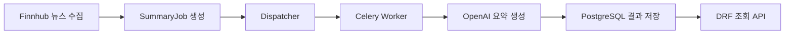

## 프로젝트 개요

StockQ는 관심 있는 미국 주식의 뉴스를 수집하고 AI 요약을 제공하는 1인 개발 백엔드 서비스입니다. Python, Django, Django REST Framework를 기반으로 뉴스 수집부터 요약 생성, 저장, 조회까지 이어지는 흐름을 구성했습니다.

- GitHub: [yeongbin05/stockq](https://github.com/yeongbin05/stockq)

## 해결하려던 문제

외부 API와 LLM을 호출하는 작업을 사용자 요청 안에서 처리하면 응답 시간이 길어지고, 일시적인 오류나 호출 제한이 사용자 경험에 직접 영향을 줍니다. 요약 작업을 단순히 Celery queue에 넣는 것만으로는 worker 처리량보다 많은 작업이 한꺼번에 유입될 때 queue가 적체되는 문제도 남았습니다.

StockQ에서는 외부 API 호출을 요청 경로에서 분리하고, 작업 상태를 데이터베이스에 기록해 처리량과 실패를 제어할 수 있는 비동기 배치 구조를 설계했습니다.

## 전체 아키텍처

PostgreSQL은 뉴스, 요약 결과와 작업 상태를 저장하고 Redis는 Celery broker와 외부 API 호출량 제어에 사용합니다.

## 비동기 요약 파이프라인

뉴스가 수집되면 바로 LLM을 호출하지 않고 `SummaryJob`을 생성합니다. Dispatcher는 처리 가능한 slot만큼 작업을 선택해 Celery worker에 전달하고, worker가 OpenAI API를 호출해 요약 결과를 저장합니다.

작업 상태는 다음과 같이 구분했습니다.

- `pending`: 실행을 기다리는 작업
- `running`: worker에 전달되어 실행 중인 작업
- `success`: 결과 저장까지 완료된 작업
- `failed`: 처리에 실패한 작업
- `retry_wait`: 호출 제한이나 일시적 오류로 재시도를 기다리는 작업

이 구조를 통해 사용자 요청은 이미 저장된 결과를 조회하고, 느리거나 실패할 수 있는 요약 생성은 별도의 실행 흐름에서 처리합니다.

## 작업 신뢰성 설계

Dispatcher가 작업을 가져갈 때 DB row lock을 사용해 여러 실행 주체가 같은 작업을 동시에 선택하지 않도록 했습니다. 각 처리 시도에는 고유한 lease token을 발급하고, worker가 결과를 저장할 때도 현재 lease가 유효한지 확인합니다. 오래된 worker가 뒤늦게 완료되더라도 최신 처리 시도의 결과를 덮어쓰지 못하게 하기 위한 장치입니다.

또한 일정 시간 이상 `running` 상태에 머문 작업을 stuck job으로 판단해 다시 처리할 수 있도록 했습니다. worker 중단이나 예기치 않은 오류가 발생해도 작업이 영구적으로 멈추지 않고 복구 흐름으로 돌아갈 수 있습니다.

## API 및 DB 성능 개선

주식 검색 API에서 객체마다 즐겨찾기 여부와 최신 가격을 조회하면서 N+1 문제가 발생했습니다. `Exists`, `Subquery` annotation을 적용해 반복 쿼리를 제거하고 CursorPagination으로 한 번에 직렬화하는 객체 수를 제한했습니다.

측정 결과는 다음과 같습니다.

| 항목 | 개선 전 | 개선 후 |
| --- | ---: | ---: |
| 검색 API 응답 시간 | 1750ms | 37ms |
| N+1 재현 테스트 쿼리 수 | 1001개 | 1개 |

SQL 실행 시간만 확인하는 데서 멈추지 않고 응답 크기와 serializer 비용까지 함께 확인해 병목을 구분했습니다.

## Rate Limit과 Backpressure

Finnhub 뉴스 수집과 OpenAI 요약 호출에는 Redis와 Lua 기반 token bucket을 적용했습니다. 여러 worker가 동시에 접근하더라도 하나의 원자적 연산으로 사용 가능한 token을 확인하고 차감합니다.

호출 slot이 부족하면 작업을 즉시 실패시키거나 무제한으로 queue에 넣지 않고 `retry_wait` 상태로 돌립니다. Dispatcher는 현재 `running` 작업 수와 `max_inflight` 한도를 기준으로 남은 처리량만 queue에 전달합니다. 이 backpressure 방식으로 생산 속도와 worker 처리 속도의 차이를 데이터베이스의 작업 상태로 흡수했습니다.

## 모니터링 및 운영

Prometheus로 애플리케이션과 작업 지표를 수집하고 Grafana에서 확인할 수 있도록 구성했습니다. 운영 중 확인이 필요한 상황은 Slack 알림으로 전달합니다.

배포 환경은 Docker Compose로 구성하고 Nginx와 Gunicorn을 통해 AWS EC2에서 서비스하며, GitHub Actions로 배포 흐름을 자동화했습니다.

## 기술 스택

- Backend: Python, Django, Django REST Framework
- Database: PostgreSQL
- Async: Celery, Redis
- External API: Finnhub API, OpenAI API
- Monitoring: Prometheus, Grafana, Slack
- Infra: Docker Compose, Nginx, Gunicorn, AWS EC2, GitHub Actions

## 배운 점

비동기 처리는 요청과 작업을 분리하는 것만으로 끝나지 않았습니다. 처리량 제한, 상태 전이, 중복 실행 방지, 오래된 실행의 결과 차단, 멈춘 작업의 복구까지 함께 설계해야 운영 가능한 파이프라인이 된다는 점을 확인했습니다.

성능 개선에서도 쿼리 수만 줄이는 데 그치지 않고 DB, serializer, 응답 크기를 구간별로 측정해야 실제 병목을 찾을 수 있었습니다.
